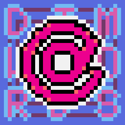

# Dimiwords Client [](https://standardjs.com)



[Dimiwords](https://github.com/JunhoYeo/dimiwords)의 PC 앱 클라이언트입니다.

- Dimiwords 계정 연결, 단어장 정보 가져와 온/오프라인으로 사용
    - 온라인 연결의 경우 기존 Dimiwords 포인트 지급

## Build

### OS X
```
electron-packager . --overwrite --platform=darwin --arch=x64 --icon=assets/icons/logo --prune=true --out=build
```

### Windows

### Linux
